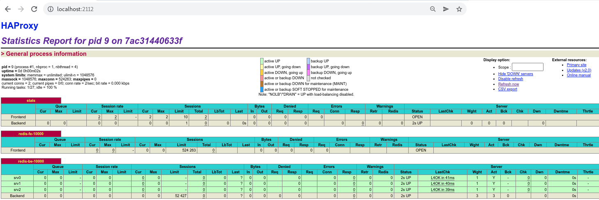

# Setup for a TCP upstream load balancer

## Using this image

```
docker run \
	-e HAPROXY_UPSTREAM_HOSTS=1.1.1.1:10000,1.1.1.2:10001,1.1.1.3:10003 \
	-e HAPROXY_LISTEN_PORT=10000 \
	--name myproxy \
	-p 2112:2112 -p 10000:10000 \
	--rm maguec/haproxy-tcp

```


## Environment variables


### Required

| ENV Var | Usage | Example |
| --- | --- | --- |
|HAPROXY_UPSTREAM_HOSTS | comma separated list of upstream IP addresses for the servers with ports| 1.1.1.1:2112,1.1.1.2:2112,1.1.1.3:2113|
|HAPROXY_LISTEN_PORT | port that the HAProxy will listen on | 10000 |


### Optional

| ENV Var | Usage | Default |
| --- | --- | --- |
|HAPROXY_STATS_USER | login for the stats page | haproxy |
|HAPROXY_STATS_PASSWORD | password for the stats page | MySekr1t |

## Stats

To access the HAProxy stats page 

http://localhost:2112 and provide the User and Password combination from above


